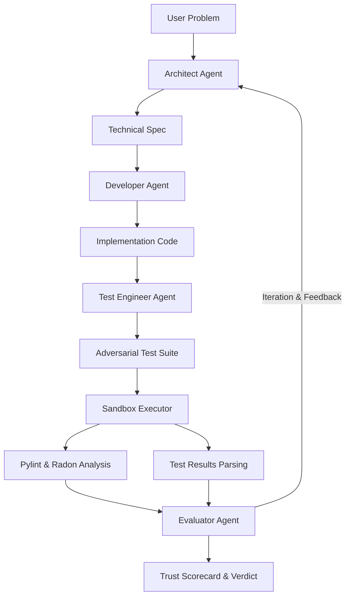

# Agentic Trust Laboratory 🧪

### *Verifying AI-Generated Software Through Recursive Multi-Agent Loops*


**Agentic Trust Laboratory** is a professional-grade multi-agent AI system designed to ensure that AI-generated code is not just "syntactically correct," but fundamentally trustworthy. By implementing a **recursive "Trust Loop"**, the system rigorously validates solutions for complex Data Structures and Algorithms (DSA) problems using adversarial testing and objective static analysis.

---

## 🧠 The Agentic "Council"

Unlike a single-prompt LLM, this system utilizes a team of specialized agents that critique and correct each other:

1.  **The Architect**: Analyzes the problem and generates a strict technical specification and Big O constraints.
2.  **The Developer**: Implements the solution in pure Python, following the Architect's spec.
3.  **The Test Engineer**: Acts as an **Adversary**. It generates comprehensive test suites including **Random Stress Tests**, pattern-breakers, and deep state invariants.
4.  **The Supreme Evaluator**: The final judge. It coordinates the execution in a sandbox, parses results, and calculates a **Trust Score** grounded in objective data.

---

## 🚀 Advanced Features

- **🛡️ Adversarial Resilience**: The system doesn't just check for "correctness"; it tries to **sabotage** the code with edge cases and high-frequency stress patterns.
- **🔄 Self-Healing Loop**: If the evaluator finds issues, the feedback is fed back to the Architect and Developer for an **iterative refine-and-retry** cycle.
- **📊 Grounded Metrics**: No more LLM hallucinations. Test passes are parsed using **regex from real output**, and code quality is measured via **Pylint** and **Radon (Cyclomatic Complexity)**.
- **⚡ Ultra-Fast Inference**: Engineered for the **Groq LPU Inference Engine**, providing near-instant reasoning cycles.
- **🔬 Transparency**: A real-time **"Thought Stream"** logs every agent's decision-making process for full observability.

---

## ⚙️ Project Architecture



---

## 🛠️ Setup & Installation

### Prerequisites
- Python 3.9+
- [Groq API Key](https://console.groq.com/keys)

### 1. Clone & Install
```bash
git clone https://github.com/your-username/Ai-code-validator.git
cd Ai-code-validator
pip install -r requirements.txt
```

### 2. Environment Configuration
Copy the example environment file and add your API key:
```bash
cp .env.example .env
```
Edit `.env` and paste your `GROQ_API_KEY`.

### 3. Run the Laboratory
```bash
streamlit run app.py
```

---

## 🔬 Verifying Trust

When evaluating a solution, the system provides:
- **Trust Grade (A-F)**: A balanced grade based on passing tests and efficiency.
- **Pylint Score**: Objective code quality rating.
- **Complexity Grade**: Radon-measured cyclomatic complexity.
- **Adversarial Status**: 🛡️ Secure vs ❌ Vulnerable badge.

---

## ⚖️ License
Distributed under the MIT License. See `LICENSE` for more information.

---
Designed for **Professional Internship Portfolio** | Powered by **Groq Llama 3.3** ⚡
